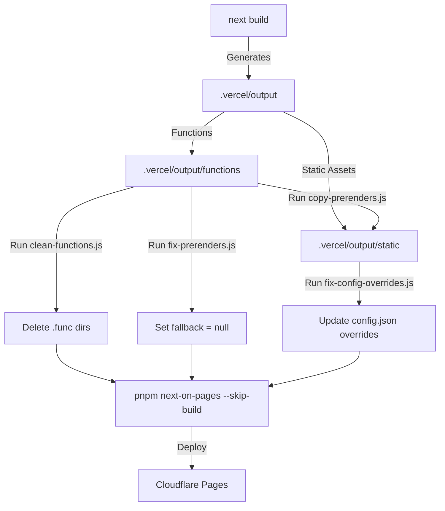

# Niyatna Design Specification

Empowering Human Intent.

---

## 1. Brand Identity & Thesis
Niyatna is the **agentic-company formation system**. It builds the operating layers, standards, gates, and command rooms that turn human intent into coordinated, autonomous, and verified agent workforces. 

### Core Positioning
- **Worldview:** AI is the new gold rush. Niyatna builds the formation system (the pickaxe and palu) to organize intent, agents, tools, permissions, memory, channels, and proof into a real company structure.
- **Essence:** *"Empowering Human Intent"*
- **Posture:** Selective, authoritative, silent-premium. Access is qualified (`Request Access`, `Begin Qualification`), never open-serve or desperate.

---

## 2. Visual & Logo Assets
The visual identity is anchored around the **intent-path ribbon mark**—a continuous, flowing satin/porcelain ribbon that subtly suggests an "N" through motion.

### Core Assets
1. **Logo Mark (`public/niyatna-logo.png`)**
   - **Type:** Standalone white 3D satin/porcelain ribbon mark.
   - **Dimensions:** 1024x1024 (cropped to actual content boundaries).
   - **Usage:** Primary branding mark on the website headers, footer, and open graph image layouts.
2. **App Icon (`public/niyatna-icon.png`)**
   - **Type:** Dark graphite rounded-square icon holding the white ribbon mark.
   - **Dimensions:** 1024x1024 (cropped to the edges of the rounded square).
   - **Usage:** App-store layouts, platform shortcuts, and cases requiring a defined container.
3. **Favicon (`app/favicon.ico`)**
   - **Type:** Multi-resolution ICO container (`16x16`, `32x32`, `48x48`, `64x64`, `128x128`, `256x256`).
   - **Source:** Cropped standalone ribbon mark (`niyatna-logo.png`) on a transparent background to maximize readability in browser tabs.

---

## 3. UI & Styling System
The site uses **Tailwind CSS v4** with a customized design theme defined in [app/globals.css](file:///home/galyarder/projects/Niyatna/app/globals.css).

### Color Palette
- **Primary Background:** Slate black/dark graphite (`oklch(0.1 0 0)` to `oklch(0.06 0 0)`).
- **Accents:** Matte porcelain / clay / soft brushed silver.
- **Grays:** Muted graphite (`oklch(0.25 0 0)`) to soft slate (`oklch(0.9 0 0)`).
- **Rule:** Strictly no generic AI purple/blue neon glows.

### Typography
- **Primary Sans:** Inter (varying weights from 100 to 900).
- **Mono:** Geist Mono.
- **Principle:** Precise typography, clean tabular data, and structured spacing over chaotic cards.

---

## 4. UI Components & Sizing
- **Site Header Logo:** Rendered at `34x34px` ([header-shell.tsx](file:///home/galyarder/projects/Niyatna/components/site/header-shell.tsx)).
- **Site Footer Logo:** Rendered at `34x34px` ([footer.tsx](file:///home/galyarder/projects/Niyatna/components/site/footer.tsx)).
- **Docs Layout Logo:** Rendered at `30x30px` ([layout.tsx](file:///home/galyarder/projects/Niyatna/app/docs/layout.tsx)).

---

## 5. Technical Build & Deployment Architecture
Because Cloudflare Pages only supports the V8 Edge Runtime, we employ a custom build pipeline to deploy our Next.js App Router project while maintaining dynamic endpoints (Search and OG Image generation) and static docs pages.

### Build Steps
1. **`pnpm dlx vercel build`**: Compiles the Next.js app to the Vercel Build Output API specification.
2. **`node scripts/copy-prerenders.js`**: Moves all pre-rendered HTML/RSC layouts and layout segments from the functions folder to the static folder.
3. **`node scripts/clean-functions.js`**: Recursively deletes all Node.js `.func` directories (except for Edge-runtime APIs like `/api/contact`, `/api/search`, `/og/docs`, `/llms.mdx/docs`, `/opengraph-image`, `/twitter-image`). This bypasses Cloudflare's Edge compatibility compilation failure.
4. **`node scripts/fix-prerenders.js`**: Patches all `.prerender-config.json` files to remove dynamic fallbacks.
5. **`node scripts/fix-config-overrides.js`**: Crawls all static HTML files and updates `.vercel/output/config.json` to configure URL paths correctly.
6. **`pnpm exec next-on-pages --skip-build`**: Compiles the edge functions and packages static assets for Cloudflare.
7. **`npx wrangler pages deploy`**: Publishes the `.vercel/output/static` folder to Cloudflare Pages.
