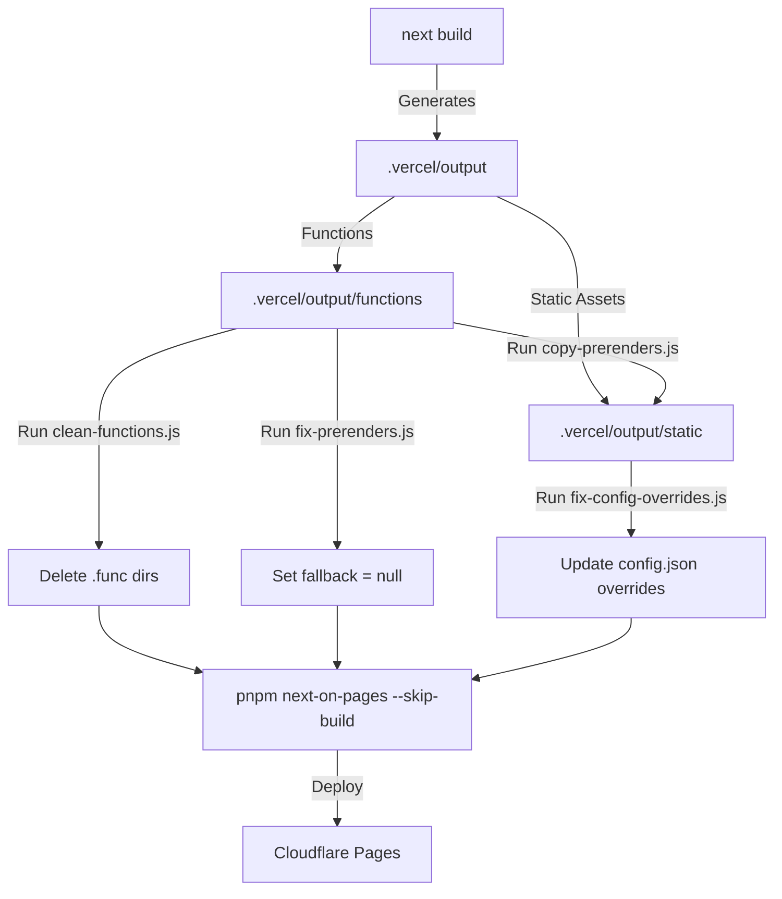

# Niyatna Design Specification

Empowering Human Intent.

---

## 1. Brand Identity & Thesis
Niyatna is the **agentic-company formation system**. It builds the operating layers, standards, gates, and command rooms that turn human intent into coordinated, autonomous, and verified agent workforces. 

### Core Positioning
- **Worldview:** AI is the new gold rush. Niyatna builds the formation system (the pickaxe and palu) to organize intent, agents, tools, permissions, memory, channels, and proof into a real company.
- **Essence:** *"Empowering Human Intent"*
- **Posture:** Selective, authoritative, silent-premium. Access is qualified (`Request Access`, `Begin Qualification`), never open-serve or desperate.

### Key Visual Characteristics
- **Color Philosophy:** Cool slate/dark graphite backgrounds layered with matte porcelain, clay, and soft brushed silver accents. Strictly no generic neon-purple or blue AI glows.
- **Logo & Mark:** A continuous, flowing satin/porcelain ribbon path that subtly suggests an "N" through motion.
- **Controls & Buttons:** Fully rounded-full (pill-shaped) elements for buttons, tags, and category labels, creating a smooth, premium feel.
- **Surface Depth:** Glassmorphism and luminance stacking (deeper is darker, elevated is lighter and more translucent) instead of heavy drop shadows.
- **Technical Ritual:** Geist Mono used for technical headers, status tickers, numeric layers, and code displays, contrasting with clean Inter sans-serif headings.

---

## 2. Visual & Logo Assets
The visual identity revolves around the white 3D satin ribbon mark representing the path of human intent being verified.

### Core Assets
1. **Logo Mark (`public/niyatna-logo.png`)**
   - **Type:** Standalone white 3D satin/porcelain ribbon mark.
   - **Dimensions:** 1024x1024 (cropped to actual content boundaries).
   - **Usage:** Primary branding mark on website headers, footer, and open graph image layouts.
2. **App Icon (`public/niyatna-icon.png`)**
   - **Type:** Dark graphite rounded-square icon holding the white ribbon mark.
   - **Dimensions:** 1024x1024 (cropped to the edges of the rounded square).
   - **Usage:** App-store layouts, platform shortcuts, and cases requiring a defined container.
3. **Favicon (`app/favicon.ico`)**
   - **Type:** Multi-resolution ICO container (`16x16`, `32x32`, `48x48`, `64x64`, `128x128`, `256x256`).
   - **Source:** Cropped standalone ribbon mark on a transparent background to maximize browser tab readability.

---

## 3. Color Palette & Roles

The website uses OKLCH color spaces for high-luminance, uniform styling, adapted for both Light and Dark themes.

### Dark Mode (Default Theme)
- **Marketing Black / Page Background:** `oklch(0.148 0.004 228.8)` — Cool slate black, the primary backdrop.
- **Surface / Card Background:** `oklch(0.218 0.008 223.9)` — Elevated graphite gray-blue surface.
- **Primary Text:** `oklch(0.987 0.002 197.1)` — Matte porcelain white (prevents eye strain).
- **Secondary Text / Body:** `oklch(0.723 0.014 214.4)` — Cool silver-gray.
- **Muted Text / Metadata:** `oklch(0.56 0.021 213.5)` — Subtle slate gray.
- **Accent Primary / Foreground Highlight:** `oklch(0.925 0.005 214.3)` — Soft brushed silver.
- **Secondary Accent:** `oklch(0.275 0.011 216.9)` — Darker neutral gray.
- **Border / Divider:** `oklch(1 0 0 / 10%)` — Subtle 10% opacity white border.
- **Input Fields:** `oklch(1 0 0 / 15%)` — Semi-transparent slate input base.

### Light Mode
- **Page Background:** `oklch(1 0 0)` — Pure white canvas.
- **Surface / Card Background:** `oklch(1 0 0)` — White card panels.
- **Primary Text:** `oklch(0.148 0.004 228.8)` — Slate black.
- **Secondary Text / Body:** `oklch(0.56 0.021 213.5)` — Graphite gray.
- **Muted Text / Metadata:** `oklch(0.56 0.021 213.5)` — Muted slate.
- **Accent Primary:** `oklch(0.218 0.008 223.9)` — Dark slate.
- **Secondary Accent:** `oklch(0.963 0.002 197.1)` — Soft porcelain gray.
- **Border / Divider:** `oklch(0.925 0.005 214.3)` — Solid light gray border.
- **Input Fields:** `oklch(0.925 0.005 214.3)` — Light gray input border.

---

## 4. Typography Rules

### Font Families
- **Primary UI / Headings:** `Inter` (sans-serif) — Clean, modern geometric display.
- **Monospace / Technical Console:** `Geist Mono` (monospace) — Used for metrics, status markers, metadata tag pills, and ticker copy.

### Typographic Hierarchy

| Role | Font | Size | Weight | Line Height | Letter Spacing | Notes |
|------|------|------|--------|-------------|----------------|-------|
| Display Hero | Inter | 72px (4.50rem) | 600 (semibold) | 1.10 (tight) | -0.04em | Tightly packed display headings |
| Display Large | Inter | 60px (3.75rem) | 600 | 1.10 | -0.04em | Section titles on landing pages |
| Section Title | Inter | 36px (2.25rem) | 600 | 1.20 | -0.04em | Standard secondary headings |
| Card Title | Inter | 20px (1.25rem) | 600 | 1.40 | -0.02em | Metric and feature card titles |
| Body Lead | Inter | 18px (1.13rem) | 400 (regular) | 1.60 | normal | Intro paragraphs, subtitles |
| Body Text | Inter | 16px (1.00rem) | 400 | 1.50 | normal | General descriptions and copy |
| Navigation Link | Inter | 14px (0.88rem) | 500 (medium) | 1.40 | normal | Header and footer nav links |
| Monospace Tag | Geist Mono | 11px (0.69rem) | 400 | 1.40 | 0.12em (wide) | Sub-headers, metadata, uppercase |
| Monospace Ticker | Geist Mono | 10px (0.63rem) | 400 | 1.40 | 0.20em (wide) | Ticker brand labels, uppercase |

---

## 5. Component Stylings

### Buttons
- **Primary CTA (Pill):** `rounded-full` (pill shape). Light mode uses slate-black background; dark mode uses light porcelain background (`oklch(0.925 0.005 214.3)`). Uses high contrast text.
- **Secondary CTA / Ghost (Pill):** `rounded-full` with an outline border (`border-border/70`) and transparent or semi-transparent background.
- **Navigation Links:** `rounded-full` wrapper, small inline sub-headers with Geist Mono labels.

### Cards & Glassmorphism
- **Glass Panel (`.glass`):**
  - **Base:** `relative rounded-2xl border backdrop-blur-xl`
  - **Light Mode:** `border-white/10 bg-white/60 shadow-[inset_0_1px_0_0_rgba(255,255,255,0.45)]`
  - **Dark Mode:** `border-white/[0.08] bg-white/[0.04] shadow-[inset_0_1px_0_0_rgba(255,255,255,0.06)]`

### Background grid
- **Grid Pattern (`.bg-grid`):**
  - **Structure:** `linear-gradient` dividers spaced at `32px 32px`.
  - **Masking:** Masked with a `radial-gradient` fading out from the center (`mask-image: radial-gradient(ellipse at center, black 30%, transparent 75%)`) to draw user focus inward.

### Infinite Ticker / Marquee
- **Marquee Wrapper:**
  - Continuous infinite translation layout (`animate-marquee`).
  - Uses absolute left/right linear gradient masks (`from-background to-transparent`) to create smooth fade edges.
  - Pauses animation on hover.

### Sizing Rules for Logo Assets
- **Site Header Logo:** Rendered at `34x34px` ([header-shell.tsx](file:///home/galyarder/projects/Niyatna/components/site/header-shell.tsx)).
- **Site Footer Logo:** Rendered at `34x34px` ([footer.tsx](file:///home/galyarder/projects/Niyatna/components/site/footer.tsx)).
- **Docs Layout Logo:** Rendered at `30x30px` ([layout.tsx](file:///home/galyarder/projects/Niyatna/app/docs/layout.tsx)).

---

## 6. Border Radius Scale
- **Micro (Radius SM):** `calc(var(--radius) * 0.6)` (~6px) — Mini status tags, inline badges.
- **Standard (Radius MD):** `calc(var(--radius) * 0.8)` (~8px) — Card contents, inputs.
- **Comfortable (Radius LG):** `var(--radius)` (10px / 0.625rem) — Section panels, icons, small image cards.
- **Panel (Radius XL):** `calc(var(--radius) * 1.4)` (~14px) — Custom containers, popup menus.
- **Card (Radius 2XL):** `calc(var(--radius) * 1.8)` (~18px) — Main featured grid cards, dialogs.
- **Pill (Full):** `9999px` / `rounded-full` — Brand marquee tags, navigation, buttons, scroll indicators.

---

## 7. Depth & Elevation
Niyatna rejects traditional dark mode shadows, which look muddy. 
- **Luminance Stacking:** Depth is achieved by lightening container backgrounds relative to their elevation: the deepest canvas is `oklch(0.148 0.004 228.8)`, cards step up to `oklch(0.218 0.008 223.9)`.
- **Translucent Borders:** Thin `border border-white/10` or `border-white/[0.08]` borders outline edges.
- **Inset Highlights:** A `1px` inner white shadow (`shadow-[inset_0_1px_0_0_rgba(255,255,255,0.06)]`) mimics lighting reflections on premium glass structures.

---

## 8. Do's and Don'ts

### Do
- Ensure all main buttons and call-to-actions are pill-shaped (`rounded-full`).
- Layer panels using `.glass` class variations for cards.
- Use Geist Mono for technical strings, metadata, uppercase labels, and metrics.
- Keep headlines tight with negative letter-spacing (`tracking-[-0.04em]`).
- Write copy matching the qualified access posture (`Request Access`, `Begin Qualification`).

### Don't
- Never inject purple, neon blue, or green AI glows/gradients.
- Don't use sharp rectangular corners for button objects.
- Don't write CTAs begging for signups (e.g. "free trials", "book a demo").
- Don't use heavy drop-shadows on dark-mode graphite cards.
- Don't mix font-families inside blocks of code (strictly use Geist Mono).

---

## 9. Responsive Behavior
- **Grid Layouts:** 3-column layouts collapse to 2-columns on tablets, and vertical single-column stacks on mobile viewports (<640px).
- **Hero Title:** Sizes down from `text-7xl` to `text-5xl` and `text-4xl` under standard Tailwind breakpoints.
- **Marquees:** Infinite scroll ticker shrinks logo size from `size-5` to `size-4` and accelerates translation velocity on mobile to prevent lag.

---

## 10. Technical Build & Deployment Architecture
Because Cloudflare Pages only supports the V8 Edge Runtime, we employ a custom build pipeline to deploy our Next.js App Router project while maintaining dynamic endpoints (Search and OG Image generation) and static docs pages.

### Build Steps
1. **`pnpm dlx vercel build`**: Compiles the Next.js app to the Vercel Build Output API specification.
2. **`node scripts/copy-prerenders.js`**: Moves all pre-rendered HTML/RSC layouts and layout segments from the functions folder to the static folder.
3. **`node scripts/clean-functions.js`**: Recursively deletes all Node.js `.func` directories (except for Edge-runtime APIs like `/api/contact`, `/api/search`, `/og/docs`, `/llms.mdx/docs`, `/opengraph-image`, `/twitter-image`). This bypasses Cloudflare's Edge compatibility compilation failure.
4. **`node scripts/fix-prerenders.js`**: Patches all `.prerender-config.json` files to remove dynamic fallbacks.
5. **`node scripts/fix-config-overrides.js`**: Crawls all static HTML files and updates `.vercel/output/config.json` to configure URL paths correctly.
6. **`pnpm exec next-on-pages --skip-build`**: Compiles the edge functions and packages static assets for Cloudflare.
7. **`npx wrangler pages deploy`**: Publishes the `.vercel/output/static` folder to Cloudflare Pages.
