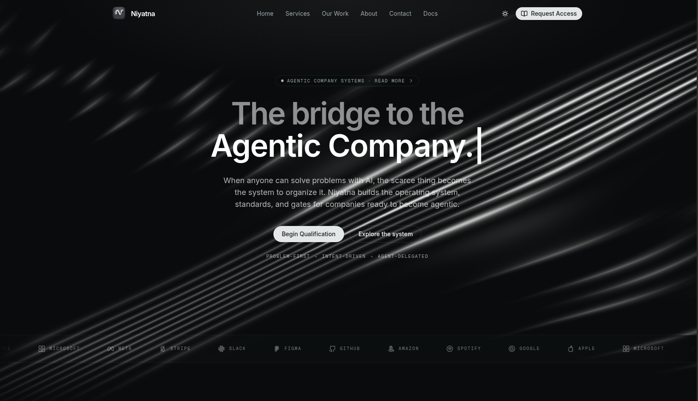

<div align="center">
  <br />
  
  <br />
  <br />
  <h3>Niyatna</h3>
  <p>The public website for <a href="https://niyatna.xyz">Niyatna</a> — the formation system for companies becoming agentic.</p>
  <br />
  <a href="https://github.com/niyatna/niyatna-web/blob/main/LICENSE"></a>
  
  
  <br />
  <br />
  
</div>

---

This repository contains the public website, documentation surface, and brand proof assets for [Niyatna](https://niyatna.xyz).

## What is Niyatna?

Niyatna is the **agentic-company formation system**: the operating layer, standards, gates, and interfaces for companies ready to run with agents.

Agents alone do not make a company agentic. A company becomes agentic when intent, people, agents, memory, permissions, recurring work, and proof operate as one governed system.

Niyatna turns company intent into owned work: routed to the right human or agent, grounded in company memory, checked through permission boundaries, and returned with evidence the company can audit.

> **Turn company intent into verified work.**

[Explore Niyatna](https://niyatna.xyz) · [Begin Qualification](https://niyatna.xyz/contact)

---

## What this website communicates

The landing page is built around one transformation:

> A normal company becomes agentic when it becomes askable, assignable, remembered, automated, and proven.

The public story avoids raw implementation screenshots as the first impression. It uses a premium abstract/editorial visual spine to explain the category before showing under-the-hood proof.

## Landing visual spine

The homepage follows the current six-image Niyatna visual spine:

1. **Hero / Intent Path** — a normal company starts becoming agentic.
2. **OS** — authorized people can ask the company system within role boundaries.
3. **HQ** — requests become owned work with assignee, due date, review gate, and proof requirement.
4. **Memory** — SOPs, decisions, departments, customers, and proof logs stop resetting.
5. **Automations + Route** — recurring work, schedules, routing, and follow-up keep moving.
6. **Proof** — every intent returns evidence and report-back.

Key implementation files:

- [`components/site/hero.tsx`](components/site/hero.tsx)
- [`components/site/demo.tsx`](components/site/demo.tsx)
- [`components/site/intent-scroll.tsx`](components/site/intent-scroll.tsx)
- [`components/site/architecture.tsx`](components/site/architecture.tsx)
- [`components/site/start.tsx`](components/site/start.tsx)

## WebGL hero waves

The hero background uses real-time WebGL line waves compiled from custom GLSL shaders, not a video or Lottie animation:

- [`components/site/background-waves.tsx`](components/site/background-waves.tsx) mounts the canvas and passes page-level parameters.
- [`components/line-waves.tsx`](components/line-waves.tsx) runs the [OGL](https://github.com/oframe/ogl) WebGL wrapper and fragment shader.

## Technical stack

- **Framework:** Next.js 16 App Router + React 19
- **Styles:** Tailwind CSS v4 with CSS-first variables and directives
- **Documentation:** Fumadocs MDX
- **Animations:** Motion for transitions and scroll-linked sections
- **Icons:** Hugeicons
- **Deployment target:** Cloudflare Pages with `@cloudflare/next-on-pages`

## Local development

Ensure you have [pnpm](https://pnpm.io) installed:

```bash
# 1. Install dependencies
pnpm install

# 2. Start local development server
pnpm dev
```

## Production build & deploy: Cloudflare Pages

The project compiles static pages using Vercel CLI and runs Edge bindings on Cloudflare Pages via `@cloudflare/next-on-pages`. Because the deployment needs custom dynamic-route and prerender repairs, use this exact pipeline:

```bash
pnpm dlx vercel build && \
node scripts/copy-prerenders.js && \
node scripts/clean-functions.js && \
node scripts/fix-prerenders.js && \
node scripts/fix-config-overrides.js && \
pnpm exec next-on-pages --skip-build && \
npx wrangler pages deploy .vercel/output/static
```

## Directory structure

```text
app/                Next.js App Router pages, metadata, OG image, favicon, and API routes
components/site/    Landing sections: Hero, visual proof, IntentScroll, Architecture, FAQ, Start
components/ui/      Primitive shadcn interface components
content/            MDX docs for Niyatna concepts, primitives, and operating surfaces
docs/               Product PRDs and implementation planning notes
lib/site.ts         Public site constants, URLs, metadata, and description
public/             Brand assets, OG image, screenshots, icons, and search indexes
scripts/            Build-time page repair, prerender patching, and deploy helper scripts
```

---

<div align="center">
  <sub>Licensed under the Apache-2.0 License.</sub>
</div>
