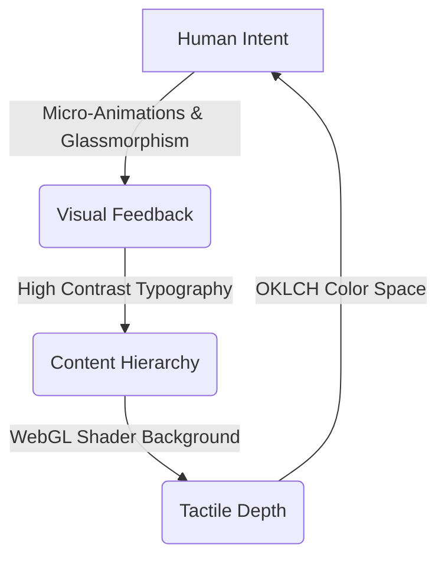

# Niyatna Web Design Guidelines

This document serves as the canonical design system manual and front-end development guideline for **Niyatna**. It ensures visual cohesion, high-fidelity user experiences, strict performance thresholds, and comprehensive accessibility across the landing page and documentation.

---

## 1. Brand & Design Philosophy: Restrained Agentic Luxury

Niyatna is the intent layer for the agentic age. It translates human will into delegated AI-agent execution, coordinates execution, and returns reviewable proof. The website interface represents this flow: clean, premium, high-contrast, and developer-centric.

* **Contrast & Restraint**: Avoid generic saturated colors. Rely on neutral monochrome palettes (light and dark) with OKLCH-derived tints.
* **Typographic Contrast**: Pair precise monospace metadata labels with modern sans-serif headings and body copy.
* **Tactile Materials**: Use thin borders, glassmorphism overlays, and WebGL backdrops to create depth without visual noise.



---

## 2. Typography System

The typography relies on standard system sans-serif fonts for reading comfort, coupled with strict monospace formatting for developer context.

* **Primary Sans-Serif**: `Inter` (defined via `--font-sans`) for body text and headings.
* **Primary Monospace**: `Geist Mono` (defined via `--font-mono`) for terminal headers, metadata, and code components.

### Monospace Accents & Eyebrows
Use monospace text for section markers, version numbers, labels, tags, and secondary action details:
* **Classes**: `font-mono text-[11px] or text-xs tracking-[0.12em] or tracking-[0.2em] uppercase text-muted-foreground`
* **Purpose**: Creates a structured, terminal-like metadata hierarchy.

### Headings
Headings must use tight tracking and balanced wraps to prevent awkward word splits:
* **Classes**: `font-semibold tracking-[-0.02em] to tracking-[-0.04em] text-balance`
* **Purpose**: Prevents orphan words on multi-line titles and ensures high-end editorial display.

### Body & Lead Text
Main content copy should remain highly readable:
* **Classes**: `max-w-2xl text-base text-muted-foreground sm:text-lg` or `text-foreground/70`
* **Purpose**: Limits line width for comfortable reading and provides natural scaling for mobile screens.

---

## 3. Color Space & Theming (OKLCH)

We use the **OKLCH** color model for uniform lightness distribution, creating harmonious light and dark modes.

| Variable | Light Theme (`:root`) | Dark Theme (`.dark`) | Context |
| :--- | :--- | :--- | :--- |
| `--background` | `oklch(1 0 0)` | `oklch(0.148 0.004 228.8)` | Page background |
| `--foreground` | `oklch(0.148 0.004 228.8)` | `oklch(0.987 0.002 197.1)` | Body copy |
| `--primary` | `oklch(0.218 0.008 223.9)` | `oklch(0.925 0.005 214.3)` | Key CTA & solid backgrounds |
| `--secondary` | `oklch(0.963 0.002 197.1)` | `oklch(0.275 0.011 216.9)` | Secondary buttons / cards |
| `--border` | `oklch(0.925 0.005 214.3)` | `oklch(1 0 0 / 10%)` | Clean partition boundaries |
| `--muted-fg` | `oklch(0.56 0.021 213.5)` | `oklch(0.723 0.014 214.4)` | Subtitles & metadata labels |

### Selection Styling
Selection backgrounds must use semi-transparent white:
* **Style**: `selection:bg-white/20 selection:text-white`

### Scrollbar Adaptation
* Enhance visibility for high-contrast preference by pairing system theme styles with thin custom tracks.
* Force dark mode color-schemes on components that display code output (`color-scheme: dark`) to maintain terminal contrast regardless of global theme.

---

## 4. Layout Patterns & Core Components

Ensure page consistency by nesting custom blocks inside semantic layout components.

### 4.1 Section Structuring
All page sections use the `Section` wrapper for padding and grid container boundaries:
```tsx
import { Section, SectionEyebrow, SectionHeading, SectionLead } from "./section"

export function Features() {
  return (
    <Section id="features">
      <div className="mx-auto max-w-3xl">
        <SectionEyebrow>01 - Core</SectionEyebrow>
        <SectionHeading>The intent layer in action.</SectionHeading>
        <SectionLead>Niyatna maps human directives directly to verified agent runs.</SectionLead>
      </div>
      {/* Grid or features content */}
    </Section>
  )
}
```

### 4.2 Liquid-Glass Overlays (`.glass`)
Used to overlay interactive components (e.g. download blocks, code frames) over the WebGL shader background:
* **CSS Class**: 
  ```css
  .glass {
    border-radius: 1rem;
    border: 1px solid rgba(255, 255, 255, 0.1);
    background-color: rgba(255, 255, 255, 0.6);
    backdrop-filter: blur(24px);
    box-shadow: inset 0 1px 0 0 rgba(255, 255, 255, 0.45);
  }
  .dark .glass {
    border-color: rgba(255, 255, 255, 0.08);
    background-color: rgba(255, 255, 255, 0.04);
    box-shadow: inset 0 1px 0 0 rgba(255, 255, 255, 0.06);
  }
  ```

### 4.3 Background Grids (`.bg-grid`)
Used to overlay structured grid patterns beneath sections to convey alignment and mathematical precision:
```css
.bg-grid {
  background-image:
    linear-gradient(to right, color-mix(in srgb, var(--border) 60%, transparent) 1px, transparent 1px),
    linear-gradient(to bottom, color-mix(in srgb, var(--border) 60%, transparent) 1px, transparent 1px);
  background-size: 32px 32px;
  mask-image: radial-gradient(ellipse at center, black 30%, transparent 75%);
}
```

---

## 5. Animation & Motion Guidelines

Animations must feel tactile and fluid, following standard physical curves rather than synthetic durations.

### 5.1 Spring-Based Easing
For popovers, interactive elements, or tab underlines, use spring and bounce parameters instead of linear ease curves:
* **Framer Motion Target**: `transition={{ type: "spring", stiffness: 320, damping: 22 }}`
* **Hover Micro-Animations**: Elevate elements slightly on hover (`y: -2`, `scale: 1.015`, `transition-transform duration-700 ease-out`).

### 5.2 WebGL Shaders
The ambient flow background is a fragment shader rendered on a canvas.
* **Control**: Keep mouse-move interactions responsive and configure dynamic brightness values tailored to resolution density.
* **Masking**: Overlay radial gradients (`mask-image: radial-gradient(...)`) on grid elements to blend backgrounds into boundaries smoothly.

### 5.3 Text Typing Simulations
For hero statements, use staggered typewriter timings to represent human intent translating to terminal input:
* **Speed**: `typeSpeed={70}`, `deleteSpeed={40}`, `pauseDelay={1700}`.

---

## 6. Accessibility & Performance Policies

High design quality must not sacrifice performance or utility.

### 6.1 CPU & Battery Conservation (Crucial)
WebGL shaders and infinite pulsing loops can drain mobile battery and hog CPU. 
* **Rule**: Use an `IntersectionObserver` to detect when interactive elements (like the background canvas or a pulsing play button) go offscreen, and suspend rendering loops immediately.
```tsx
React.useEffect(() => {
  const io = new IntersectionObserver(
    ([entry]) => setInView(entry.isIntersecting),
    { threshold: 0.15 }
  )
  if (elementRef.current) io.observe(elementRef.current)
  return () => io.disconnect()
}, [])
```
* **Reduced Motion**: Listen to preference values (`useReducedMotion` hook) to disable scaling, spring loops, and background wave movements.

### 6.2 Focus States
Every focusable element must support visible focus states using a standard ring treatment that matches the brand color:
* **Class**: `focus:outline-none focus-visible:ring-2 focus-visible:ring-foreground/60`

### 6.3 Performance (CLS & LCP Optimization)
* **Image Delivery**: Serve critical hero/LCP images with high loading priority (`priority` prop in Next.js Image or `fetchpriority="high"`). Use next-gen image formats (AVIF/WebP) and provide explicit aspect-ratio sizing to prevent Cumulative Layout Shifts (CLS).
* **Render Deferral**: Defer rendering for large lists or docs that sit below the fold using `content-visibility: auto` alongside estimated containment heights to reduce initial rendering paint time.
